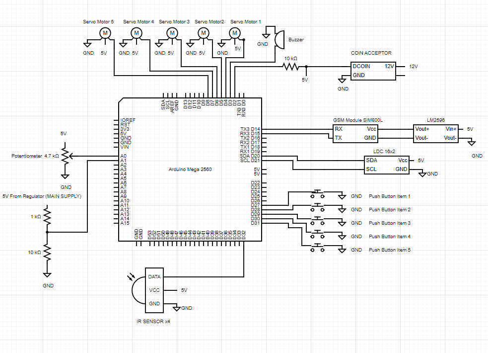

# VendingMachine
5 items to choose in vending machine with sms notification to notify the owner if someone buys every single item on the vending machine and if someone force to open the vending machine and if the main plug had been cut. It buzzes when it happens for at least 5 seconds and after 5 mins buzzes again until the backup battery dies. Notification when the main power ac adaptor was cut. Second power source which is the li-ion will be used for only buzzer and sms notification not for dispensing.

## Steps to Setup VendingMachine
1. Clone this repository 
```
git clone https://github.com/pd1drone/VendingMachine
```
2. Get the LiquidCrystal_I2C folder and copy it to the folder libraries it is located the arduino codes has been save it will have a libraries folder. The default folder of arduino is in /Documents/Arduino/libraries/


3. Setup the Schematic Diagram Below


4. After setting up the Schematic Diagram Open the VendingMachine.ino file in arduino and then upload.

5. To adjust the movement of the servo motor go to the VendingMachine.ino file Line 653-665, and change the delay values based on how long will the servo motor run per quantity of item
```
void DelayFunc(int numberofItems){
  if(numberofItems==1){
    delay(1500);
  }else if (numberofItems==2){
    delay(3000);
  }else if (numberofItems==3){
    delay(4500);
  }else if (numberofItems==4){
    delay(6000);
  }else if (numberofItems==5){
    delay(7500);
  }
}
```
6. Adjust number of recipient in line 101
```
String number = "+639264562589"; //-> change with your number
```

## Format of SMS Command
### To know the Total Amount in the Vending machine you need to send an sms message and it should look like this:
```
Total amount inserted from the vending machine?
```

### To tell the Vending Machine that the inventory of the items had been fully restocked you need to send an sms message that should look like this:
```
Fully restocked the items in vending machine
```

### To get the summary of inventory of items that are left in the vending machine send an sms message that should look like this:
```
How many items left on the vending machine?
```

